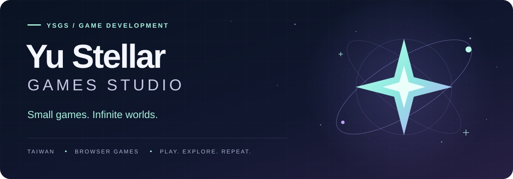
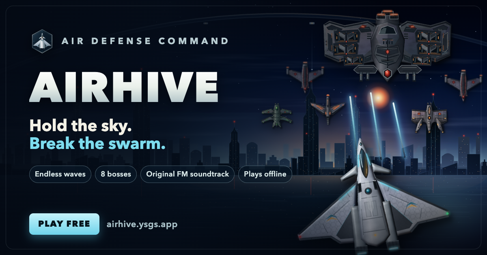
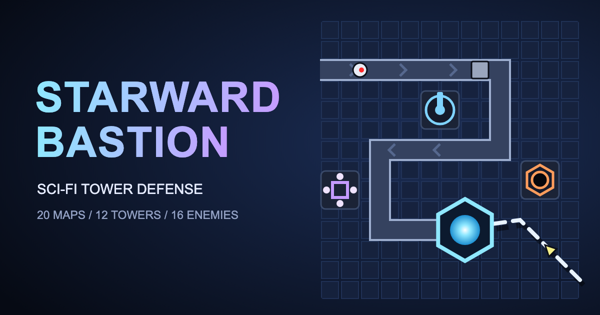
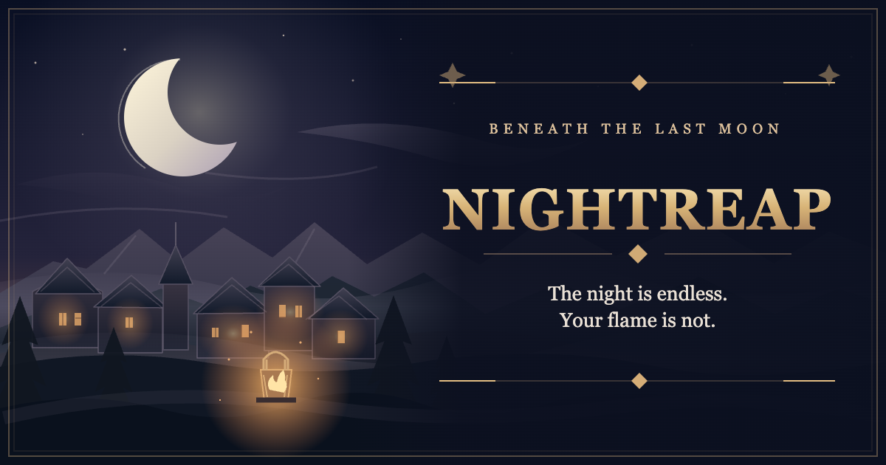
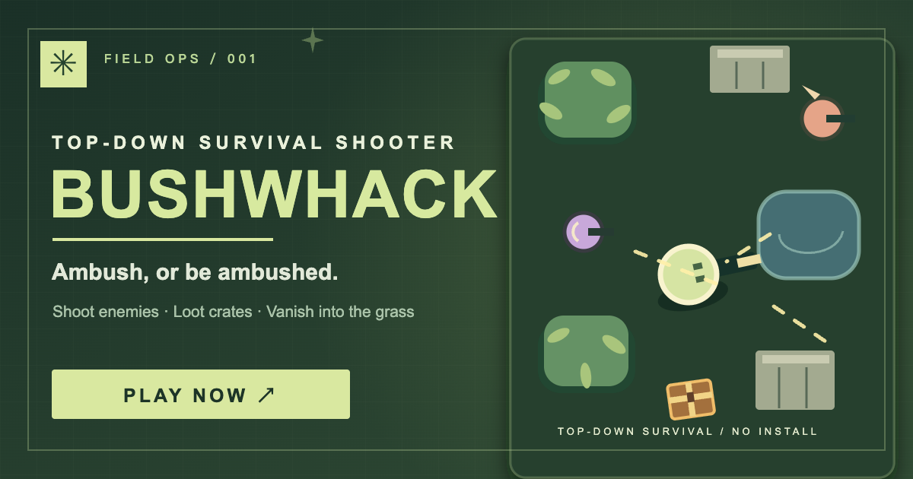
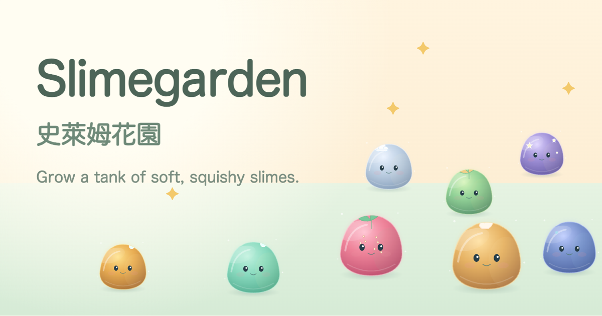
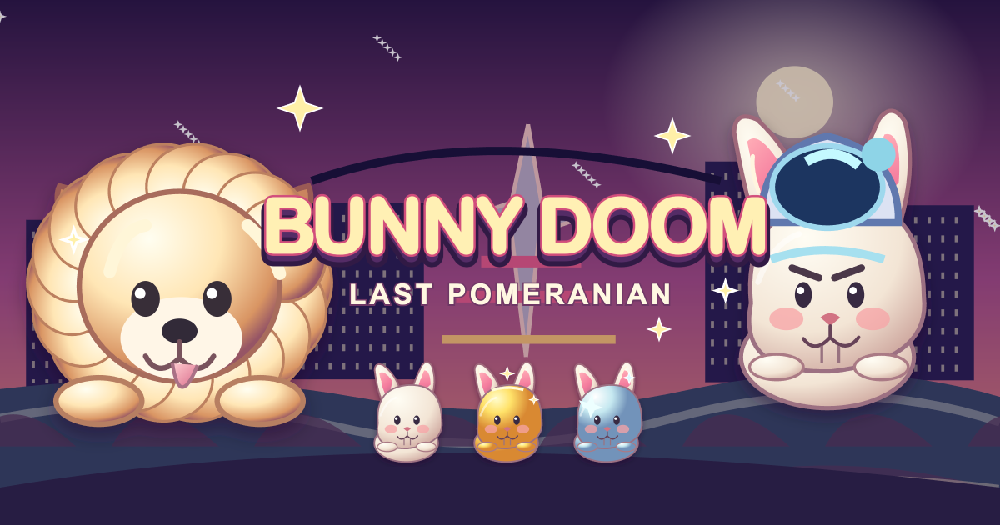
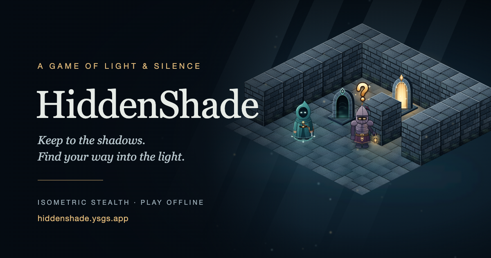

  

<h1 align="center">把小小的靈感，做成可以玩的世界。</h1>

  這裡是 <strong>Yu Stellar Games Studio</strong>，來自台灣的遊戲開發工作室。 
  從星際防線到窗邊花園，打開瀏覽器，就是另一場冒險。

  <a href="#choose-your-world">探索遊戲</a> &nbsp; / &nbsp;
  <a href="https://github.com/orgs/YuStellarGamesStudio/repositories">查看原始碼</a> &nbsp; / &nbsp;
  <a href="mailto:to@yustellar.dev">聯絡我們</a>

 

## Choose your world

七個世界，七種心情。選一款，開始玩。

<table>
  <tr>
    <td width="40%">
      
    </td>
    <td>
      ARCADE / AIR COMBAT
      <h3>蜂群戰線 · Airhive</h3>
      
一架戰機，一整片天空。迎擊蜂群，守住最後防線。

      <a href="https://airhive.ysgs.app/"><strong>開始遊戲 ↗</strong></a> &nbsp; · &nbsp; <a href="https://github.com/YuStellarGamesStudio/Airhive">Source</a>
    </td>
  </tr>
  <tr>
    <td width="40%">
      
    </td>
    <td>
      STRATEGY / TOWER DEFENSE
      <h3>星域防線 · Starward Bastion</h3>
      
部署防禦塔，擋下機械軍團。守護星際殖民地的能源核心。

      <a href="https://starwardbastion.ysgs.app/"><strong>開始遊戲 ↗</strong></a> &nbsp; · &nbsp; <a href="https://github.com/YuStellarGamesStudio/StarwardBastion">Source</a>
    </td>
  </tr>
  <tr>
    <td width="40%">
      
    </td>
    <td>
      DARK FANTASY / ACTION RPG
      <h3>永夜收割 · Nightreap</h3>
      
走進無盡長夜，尋找戰利品與遺物。讓最後的火光繼續燃燒。

      <a href="https://nightreap.ysgs.app/"><strong>開始遊戲 ↗</strong></a> &nbsp; · &nbsp; <a href="https://github.com/YuStellarGamesStudio/Nightreap">Source</a>
    </td>
  </tr>
  <tr>
    <td width="40%">
      
    </td>
    <td>
      ACTION / SURVIVAL SHOOTER
      <h3>草叢突擊 · Bushwhack</h3>
      
潛入草叢、搜刮補給、升級火力。伏擊，或被伏擊。

      <a href="https://bushwhack.ysgs.app/"><strong>開始遊戲 ↗</strong></a> &nbsp; · &nbsp; <a href="https://github.com/YuStellarGamesStudio/Bushwhack">Source</a>
    </td>
  </tr>
  <tr>
    <td width="40%">
      
    </td>
    <td>
      COZY / IDLE
      <h3>史萊姆花園 · Slimegarden</h3>
      
養一缸軟綿綿的史萊姆。慢慢合成、發現配方，收藏窗邊的小幸福。

      <a href="https://slimegarden.ysgs.app/"><strong>開始遊戲 ↗</strong></a> &nbsp; · &nbsp; <a href="https://github.com/YuStellarGamesStudio/Slimegarden">Source</a>
    </td>
  </tr>
  <tr>
    <td width="40%">
      
    </td>
    <td>
      CASUAL / WHACK-A-MOLE
      <h3>兔兔末日 · Bunny Doom: Last Pomeranian</h3>
      
兔兔佔領了世界，最後一隻博美犬挺身反擊。敲打兔兔、蓄力放招，挑戰兔王！

      <a href="https://bunnydoom.ysgs.app/"><strong>開始遊戲 ↗</strong></a> &nbsp; · &nbsp; <a href="https://github.com/YuStellarGamesStudio/BunnyDoom">Source</a>
    </td>
  </tr>
  <tr>
    <td width="40%">
      
    </td>
    <td>
      STEALTH / MAZE ESCAPE
      <h3>藏影迷城 · HiddenShade</h3>
      
避開巡邏者的視線，躲進暗處，找到暖光出口。迷宮型躲貓貓。

      <a href="https://hiddenshade.ysgs.app/"><strong>開始遊戲 ↗</strong></a> &nbsp; · &nbsp; <a href="https://github.com/YuStellarGamesStudio/HiddenShade">Source</a>
    </td>
  </tr>
</table>

 

## Beyond the play button

遊戲在瀏覽器裡開始，探索不必停在遊戲裡。

- **For players** — 直接打開遊戲連結；遇到問題或有新點子，歡迎到對應專案的 Issues 留言。
- **For developers** — 七款作品皆公開原始碼，歡迎研究實作；使用與修改請遵循各專案的授權條款。
- **Say hello** — 遊戲交流與合作聯絡：<a href="mailto:to@yustellar.dev">to@yustellar.dev</a>。

---

  YU STELLAR GAMES STUDIO · MADE IN TAIWAN 
  <strong>下一個世界，從一個小小的靈感開始。</strong>

<!--
維護與部署

這份 README 用於倉庫介紹與 ysgs.app 官網，保留遊戲介紹及相對路徑圖片。
不含遊戲介紹的軟體開發向組織 Profile 位於 .github/profile/README.md。
部署組織首頁時，請將該檔案放入公開倉庫 YuStellarGamesStudio/.github 的
profile/README.md；不需複製遊戲圖片。目前倉庫的 .github/ 目錄不會自動顯示於組織首頁。
GitHub 官方說明：
https://docs.github.com/en/organizations/collaborating-with-groups-in-organizations/customizing-your-organizations-profile

網站分享預覽由 _config.yml 設定，使用 assets/banner.png（1280 × 640）。
GitHub Pages 建置時會產生 OG 與 Twitter Card 標籤；更換分享圖時需同步更新尺寸與替代文字。
這些設定僅作用於 ysgs.app，不會修改 GitHub 倉庫頁面的 Social preview。

banner.svg 為本網站製作的靜態向量圖；遊戲封面取自各作品公開網站：
assets/airhive.png — https://airhive.ysgs.app/assets/social/og-image.png
assets/starward-bastion.png — https://starwardbastion.ysgs.app/assets/share-en-630x500.png
assets/nightreap.png — https://nightreap.ysgs.app/assets/social/nightreap-social.png
assets/bushwhack.png — https://bushwhack.ysgs.app/assets/og-cover.png
assets/slimegarden.png — https://slimegarden.ysgs.app/assets/og-image.png
assets/bunnydoom.png — https://bunnydoom.ysgs.app/assets/icons/og.png（轉為 PNG）
assets/hiddenshade.png — https://hiddenshade.ysgs.app/assets/og.png
更新作品時，請同步維護封面、替代文字、簡介、遊戲與原始碼連結。
-->
